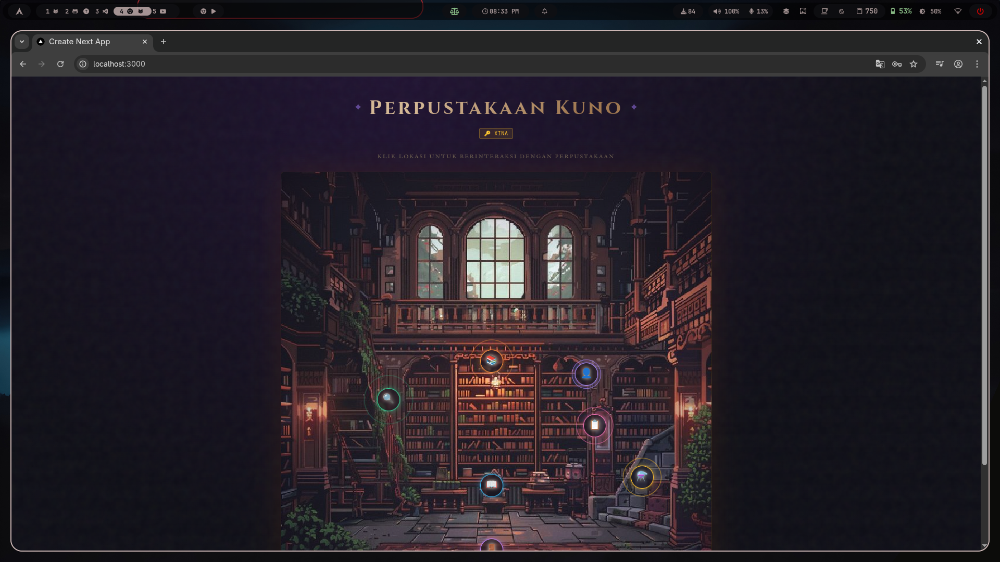
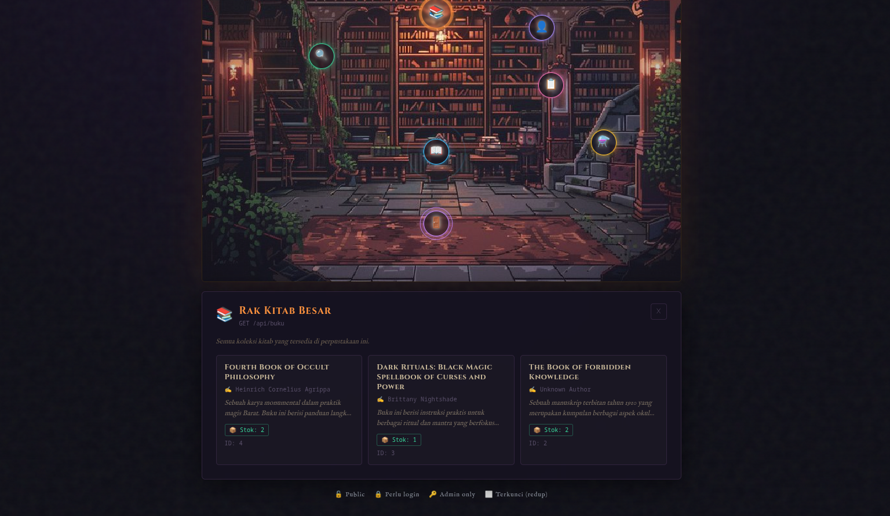
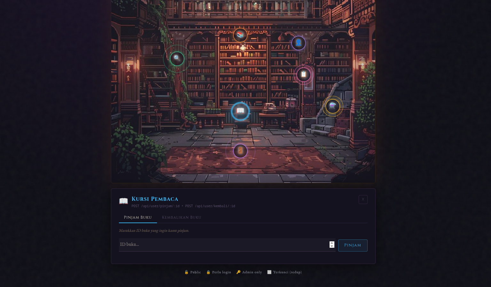

# 📚 Library Management System

Modern web-based **Library Management System** built with a scalable full-stack architecture using **Next.js** and **Golang**.

Designed to manage books, borrowing records, and user authentication with a clean and modular backend architecture.

---

# ✨ Preview

## Dashboard


## Books Management


## Borrowing System


## History


---

# 🧠 Architecture

This project follows a **separated frontend-backend architecture**.

```
Frontend  →  REST API  →  Backend  →  Database
Next.js       HTTP        Golang       SQL
```

---

# 🧱 Tech Stack

## Frontend

| Technology | Description |
|------------|-------------|
| Next.js | React Framework |
| React | UI Library |
| TypeScript | Static typing |
| TailwindCSS | Styling |

## Backend

| Technology | Description |
|------------|-------------|
| Golang | Backend language |
| JWT | Authentication |
| REST API | API communication |
| Middleware | Authorization layer |

---

# 📦 Project Structure

```
perpustakaan
├── backend
│   ├── config
│   │   └── database.go
│   │
│   ├── handlers
│   │   ├── login.go
│   │   ├── register.go
│   │   ├── tambahbuku.go
│   │   ├── updatebuku.go
│   │   ├── deletebuku.go
│   │   ├── peminjaman.go
│   │   └── pengembalian.go
│   │
│   ├── middleware
│   │   ├── auth.go
│   │   └── admin.go
│   │
│   ├── models
│   │   ├── user.go
│   │   ├── buku.go
│   │   └── peminjaman.go
│   │
│   ├── routers
│   │   └── router.go
│   │
│   └── services
│       ├── hashpassword.go
│       ├── cekpassword.go
│       └── jwtgenerate.go
│
└── frontend
    ├── app
    ├── components
    ├── styles
    └── pages
```

---

# 🔑 Features

### Authentication

- User Registration
- Secure Login
- JWT Authentication
- Role-based Access

### Book Management

- Add new books
- Update book information
- Delete books
- Fetch books list

### Borrowing System

- Borrow books
- Return books
- Track borrowing history

### Security

- Password hashing
- JWT tokens
- Auth middleware
- Admin protection

---

# 🚀 Installation

## Clone Repository

```bash
git clone https://github.com/yourusername/perpustakaan.git
cd perpustakaan
```

---

# Backend Setup

```
cd backend
go mod tidy
go run main.go
```

---

# Frontend Setup

```
cd frontend
npm install
npm run dev
```

Application will run at:

```
http://localhost:3000
```

---

# 🔌 API Example

| Method | Endpoint | Description |
|------|------|------|
| POST | /login | User login |
| POST | /register | User registration |
| GET | /books | Get books |
| POST | /books | Add book |
| PUT | /books/:id | Update book |
| DELETE | /books/:id | Delete book |

---

# 📜 Security Design

Authentication is implemented using **JWT tokens**.

Flow:

```
Login
 ↓
JWT Generated
 ↓
Token sent to client
 ↓
Protected routes via middleware
```

---

# 🧪 Development Philosophy

This project is built with a focus on:

- modular backend structure
- clean separation of concerns
- scalable architecture
- maintainable codebase

---

# 📷 Screenshots

Add your screenshots inside:

```
assets/
```

Example:

```
assets/
 ├── dashboard.png
 ├── books.png
 ├── borrow.png
 └── history.png
```

---

# 👨‍💻 Author

Emma

```
Student Developer exploring backend systems, system architecture,
and modern web development.
```

---

# ⭐ If you like this project

Give it a star on GitHub.
